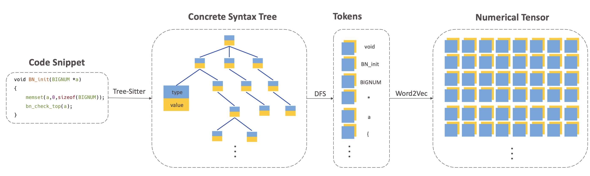
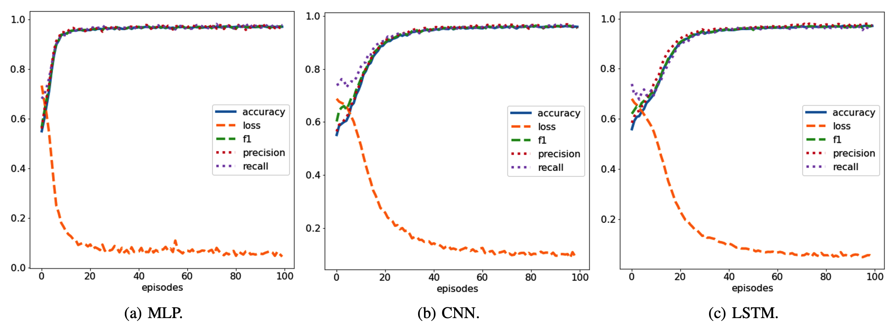

# Code2Tensor
**Tensor representation of code for vulnerability detection.** [[video link](https://www.youtube.com/watch?v=e9-BLD9dxts)]




With the explosive growth of the amount of code in recent years, more and more vulnerabilities are weakening the overall security of computer systems. However, it is hard to detect the vulnerabilities in large projects, because of the complex project structures, interactive calls of multiple programming languages, and dependence on domain knowledge. An expressive code embedding can facilitate the machine learning model to understand abstract semantics. Code2Vec pioneers research in this field, but it only quantizes the codes into one-dimensional vectors, losing a lot of latent information. In this paper, we put forward a Code2Tensor framework to get a tensor representation of codes. By feeding the tensors of C++ codes to deep learning models for vulnerability detection, we show the huge potential of applying the code tensorization to other deep learning pipelines.


## All Project Assignments

In the milestones folder.

## Configurations

```shell
mkdir vendor
cd vendor
git clone https://github.com/tree-sitter/tree-sitter-cpp
```

## Code Scripts

**After configurations**, you can run the notebooks files. Code2Tensor\*.ipynb files are source codes and demos of different neural networks and sets of parameters. For standardization, I clean the output of the notebooks, the results of last run are store in the png files. For a visible version, you can refer to https://gist.github.com/LovelyBuggies/078139f8f3afe6d3b09c1120dd1c74e8 (the model with best performance).



## Raw Data

The raw data we used or tested are put into dataset folder. We use D2A dataset, which can be obtained from https://developer.ibm.com/exchanges/data/all/d2a/ - "get this data".

## Clarification

**The proposal, revised proposal, progress report, final report are in the milestone folder, links to demo on [Youtube](https://www.youtube.com/watch?v=e9-BLD9dxts), [links to datasets](https://dax-cdn.cdn.appdomain.cloud/dax-d2a/1.1.0/d2a_leaderboard_data.tar.gz), no slides for demo (it's based on a [notebook](https://gist.github.com/LovelyBuggies/078139f8f3afe6d3b09c1120dd1c74e8)) and [my volunteer presentations](https://docs.google.com/presentation/d/1tcrfCDm6tggUVgHSKYYHXiIONOjN3x-Tlh86mzAdCxE/edit?usp=sharing) . It's different from my midterm project.**   
